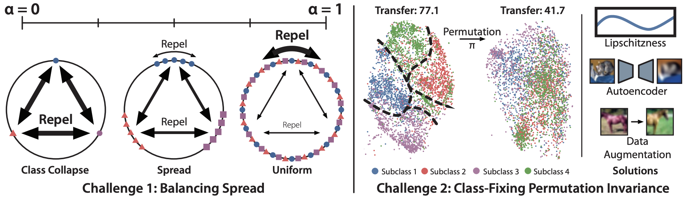

# **Perfectly Balanced: Improving Transfer and Robustness of Supervised Contrastive Learning.**

<div>
  
</div>

This is the official repo for the paper [Perfectly Balanced: Improving Transfer and Robustness of Supervised Contrastive Learning](https://arxiv.org/abs/2204.07596).
It is built on PyTorch and uses [Hydra](https://hydra.cc/docs/intro/) to configure training runs.

## **Set-Up Commands**
To set-up the repo, please use the following commands:

```
git clone https://github.com/HazyResearch/thanos-code.git
cd thanos-code
export PATH="<path to conda dir>/anaconda3/bin:$PATH"
conda create -n unagi_env python=3.8
conda activate unagi_env
make dev
```

To test out the install, run this command to train on CIFAR for a few epochs.

```
unagi +experiment=test dataflow.data_dir=LOCAL_PATH_TO_DOWNLOAD_CIFAR
```

## **Experiments**
Instructions to run coarse-to-fine transfer experiments on CIFAR10.
To turn on wandb logging, add `wandb.mode=online` to any command.

### **Coarse Training**

Commands to train with coarse labels.
Remember the checkpoint paths for each of these commands

1. SupCon
```
unagi +experiment=cifar10_supcon_cep_coarselabels dataflow.data_dir=/ABSOLUTE_PATH_TO_DATA
    learner.checkpoint_scheduler.dirpath=/ABSOLUTE_PATH_TO_COARSE_MODEL_CHECKPOINT_FOLDER
```

2. SupCon + class-conditional InfoNCE
```
unagi +experiment=cifar10_lspread_cep_coarselabels dataflow.data_dir=/ABSOLUTE_PATH_TO_DATA
    learner.checkpoint_scheduler.dirpath=/ABSOLUTE_PATH_TO_COARSE_MODEL_CHECKPOINT_FOLDER
```

3. Class-conditional Autoencoder
```
unagi +experiment=cifar10_cep_autoencoder_coarselabels dataflow.data_dir=/ABSOLUTE_PATH_TO_DATA
    learner.checkpoint_scheduler.dirpath=/ABSOLUTE_PATH_TO_COARSE_MODEL_CHECKPOINT_FOLDER
```

### **Transfer to Fine Labels**
Commands to transfer on fine labels.
To evaluate one of the coarse-trained models on fine labels, run the following command, replacing `/ABSOLUTE_PATH_TO_COARSE_MODEL_CHECKPOINT_FOLDER` with the folder of the coarse model checkpoint:
```
unagi +experiment=cifar10_cep_xfer dataflow.data_dir=/ABSOLUTE_PATH_TO_DATA 
    learner.checkpoint_scheduler.dirpath=/ABSOLUTE_PATH_TO_FINE_MODEL_CHECKPOINT_FOLDER
    model.encoders.ImageEncoder.path_to_checkpoint=/ABSOLUTE_PATH_TO_COARSE_MODEL_CHECKPOINT_FOLDER/best.pth 
    model.embeddings.ImagePreEncoder.path_to_checkpoint=/ABSOLUTE_PATH_TO_COARSE_MODEL_CHECKPOINT_FOLDER/best.pth
```

To evaluate Thanos, use the embeddings from both the SupCon + class-conditional InfoNCE and the class-conditional autoencoder at once in two backbones, replacing `/SUP_CHECKPOINT` with the absolute path to the contrastive checkpoint folder, and `/AUTO_CHECKPOINT` with the absolute path to the autoencoder checkpoint folder:
```
unagi +experiment=cifar10_cep_twobackbones_xfer dataflow.data_dir=/ABSOLUTE_PATH_TO_DATA 
    learner.checkpoint_scheduler.dirpath=/ABSOLUTE_PATH_TO_FINE_MODEL_CHECKPOINT_FOLDER
    model.encoders.ImageEncoderSup.path_to_checkpoint=/SUP_CHECKPOINT/best.pth 
    model.embeddings.ImagePreEncoderSup.path_to_checkpoint=/SUP_CHECKPOINT/best.pth
    model.encoders.ImageEncoderAuto.path_to_checkpoint=/AUTO_CHECKPOINT/best.pth 
    model.embeddings.ImagePreEncoderAuto.path_to_checkpoint=/AUTO_CHECKPOINT/best.pth
```

### Expected Performance
We expect this performance on the fine-grained transfer for the above options:
| Method                                 | Accuracy |
| -------------------------------------- | -------- |
| SupCon                                 | 51.8     |
| SupCon + class-conditional InfoNCE     | 77.1     |
| SupCon + class-conditional autoencoder | 71.7     |
| Thanos                                 | 79.1     | 

### **Other Datasets**
To run CIFAR100, replace the experiment with the corresponding `cifar100` experiment.

To run MNIST experiments, add `dataflow=mnist model.encoders.ImageEncoder.l_max=50` to the command.
For the coarse experiments, additionally add `dataflow.dataset.mnist.coarse_labels=True`.
For the two backbone transfer experiments, add `model.encoders.ImageEncoderSup.l_max=50 model.encoders.ImageEncoderAuto.l_max=50` instead of `model.encoders.ImageEncoder.l_max=50`.

To run TinyImageNet experiments, first download TinyImageNet from [http://cs231n.stanford.edu/tiny-imagenet-200.zip](http://cs231n.stanford.edu/tiny-imagenet-200.zip).
Then unzip the folder, and add `dataflow=tinyimagenet_coarse model.encoders.ImageEncoder.l_max=257 +dataflow.dataset.tinyimagenet_coarse.root_folder=/PATH_TO_FOLDER/tiny-imagenet-200` for the coarse experiments.
For the fine experiments, additionally add `dataflow.dataset.tinyimagenet_coarse.coarse_labels=False`.
For any experiment with an autoencoder (including the two-backbone one), add `model.decoders.ImageReshape.d_input=4096 model.decoders.ImageReshape.output_height=64 model.decoders.ImageReshape.output_width=64 model.decoders.ImageDecoder.input_height=64`.
For the two backbone experiment, add `model.encoders.ImageEncoderSup.l_max=257 model.encoders.ImageEncoderAuto.l_max=257`.

## If you found our work useful, please cite our papers:

```
@article{chen2022perfectly,
  author = {Mayee F. Chen and Daniel Y. Fu and Avanika Narayan and Michael Zhang and Zhao Song and Kayvon Fatahalian and Christopher R\'e},
  title = {Perfectly Balanced: Improving Transfer and Robustness of Supervised Contrastive Learning},
  booktitle = {Proceedings of the 39th International Conference on Machine Learning (ICML 2022)},
  year = {2022},
}
```

```
@inproceedings{fu2022details,
  author = {Daniel Y. Fu and Mayee F. Chen and Michael Zhang and Kayvon Fatahalian and Christopher R\'e},
  title = {The Details Matter: Preventing Class Collapse in Supervised Contrastive Learning},
  journal = {Workshop on Artificial Intelligence with Biased or Scarce Data (AIBSD) at the 36th AAAI Conference on Artificial Intelligence},
  year = {2022},
}
```
